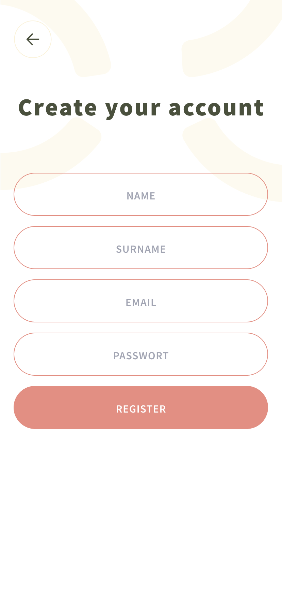
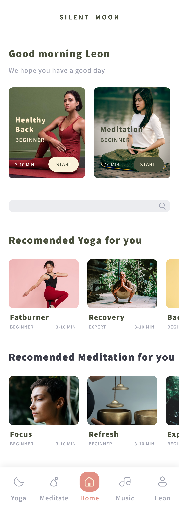
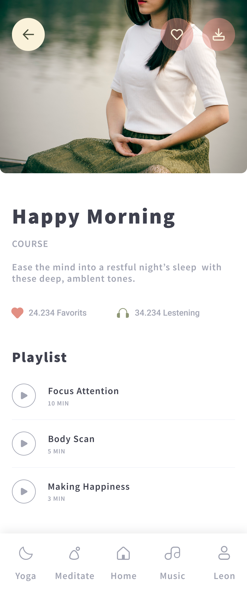
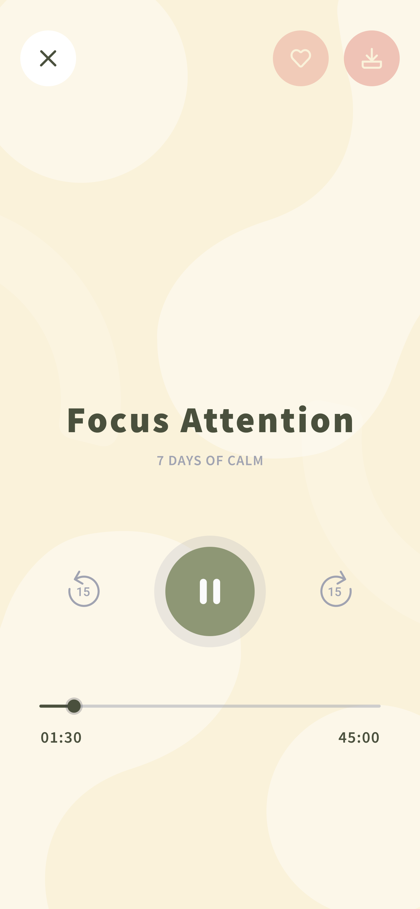
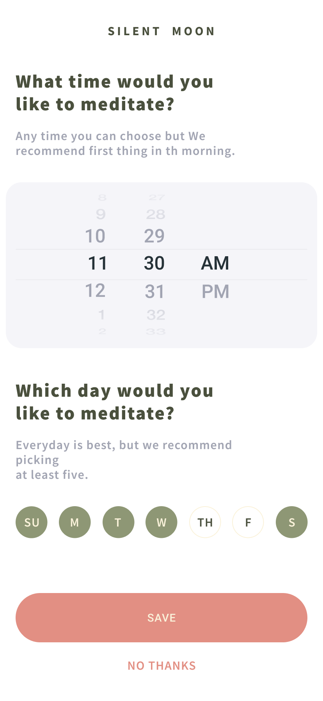

# Silent Moon – die Musik-App für Yoga und Meditation

## Idee

Eine App, die Musik für Yoga und Meditation je nach Stimmung vorschlägt.

Nutzer_innen können sich registrieren und ein Profil erstellen, dort Favoriten hinterlegen, ihre Daten einsehen, ändern (Passwort, Bild hochladen), sich Playlists vorschlagen lassen und Musik abspielen lassen.

## Umsetzung

Die App wurde realisiert mit Hilfe von 
- HTML
- CSS
- Git und des 
- MERN-Stacks (MongoDB, Express, React, NodeJS)
- Spotify-API.

Weil Spotify selbst ein Einloggen verlangt, sind die Spotify-Daten nicht frei abrufbar (und ein Push auf Heroku bspw. nicht möglich). Die Daten speisen sich hier folglich aus dem Local Storage. Das wäre in der Realität nicht funktional.

### Einige Screenshots der User-Interface der App

## Team

:peacock: [Nikos Dimitriadis](https://github.com/nikdimitriadis)  

:eagle: [Sertac Özdemir](https://github.com/schmelzofen)  

:flamingo: [Julia Rinzilotti](https://github.com/JuliaRinzilotti)  

:parrot: [Lukas Schornstein](https://github.com/LukasSchornstein)  

